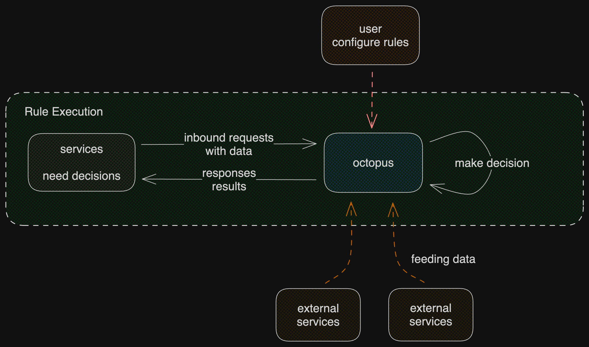

# octopus

> Note: octopus is a new project :D

octopus aims to be a simple but powerful rule engine (e.g., for risk management, or other decision making).

octopus includes two projects:

- **octoback**: the backend project written in golang.
- **octofront**: the frontend project written using angular.

octopus allows users to define rules. A rule defines how octopus should react to inbound requests; describes what decisions should be made based on the context (the data), and finally what responses to be returned.

Each rule is executed based on a context. In most cases, the context is the inbound request. However, external services may feed octopus data such that a much more complex rule can be defined and executed.

