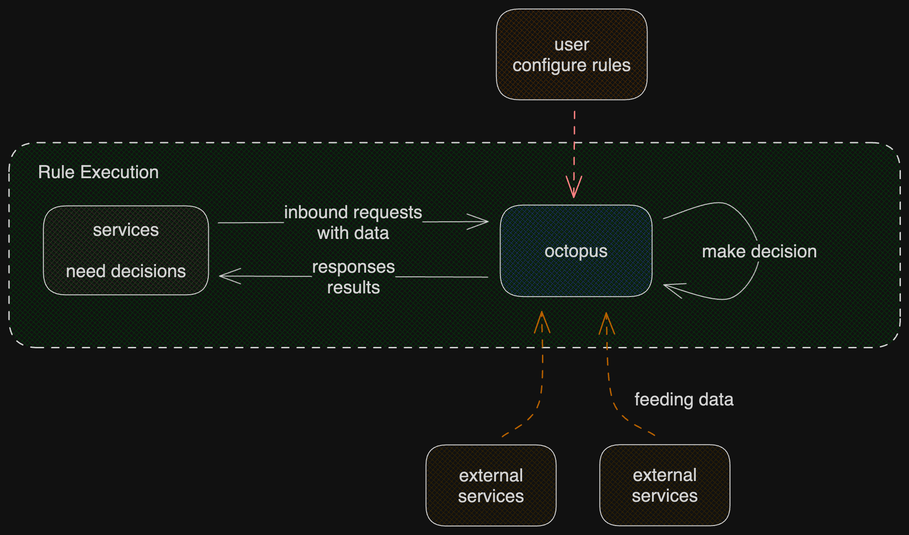

# octopus

> Note: octopus is a new project, I am still thinking about the design :D

octopus aims to be a simple but powerful rule engine (e.g., for risk management, or other decision making).

octopus includes two projects:

- **octoback**: the backend project written in golang.
- **octofront**: the frontend project written using angular.

## How it works?

octopus allows users to define rules. A rule defines how octopus should react to inbound requests; describes what decisions should be made based on the context (the data), and finally what responses to be returned.

Each rule is executed based on a context. In most cases, the context is the inbound request. However, external services may feed octopus data such that a much more complex rule can be defined and executed.



## Data Format

In octopus, rules are defined to react to inbound requests and to produce reasonable responses. Inbound requests are all in application/json format, so basically, just a bunch of json objects. The extra data fed into octopus is also just a bunch of json objects.

However, there is a limitation. The json object should be flat and simple. In other words, there should only be one layer, fields shouldn't also be an object. If the original data doesn't satisfy the requirements, you may will just do some transformations. The reason behind this limitation is that the data descriptor only handles simple type fields. The descriptor simpily cannot handle fields of some nested object.

If the nested object fields are not actually used by octopus, i.e., not defined in any data descriptor or rule, octopus will simply ignore these fields, so transformation is not necessary as well.

The following format is expected:

```json
{
    "userId": "xxxx",
    "orderNo": "yyyy"
}
```

But this one is not:

```json
{
    "userId": "xxxx",
    "order": {
        "orderNo" : "yyyy",
    }
}
```

## Data Descriptor

octopus depends on a data descriptor to understand the data provided by the external services. In essence, it's a key-value mapping object that describes each field of the objects in the data, it basically looks like this:

```json
{
    "userId": { "identifier" : "user_id", "name" : "User Id" , "desc" : "User identifier of the whole system" },
    "orderNo": { "identifier" : "order_no", "name" : "Order No", "desc" : "Order no of the forward transaction" }
}
```

Fields that exist in data objects, but not described by the data descriptor are simply ignored by octopus, it just doesn't know how to deal with them.

Simple enough, data descriptors are merely kv json objects. octopus will of course provide a UI for users to edit them. Since these are simply json objects, they can also be loaded using APIs.

## Expressions

In order to flexibly express the logics, an expression engine will be embedded inside octopus. The Lua language will very likely be used.

Libraries:

- https://github.com/yuin/gopher-lua
- https://github.com/Shopify/go-lua

It seems likes yuin/gopher-lua is actually more performant, but shopify/go-lua is more compatible with lua5.2.

## Data Point

Data Point is the result of transformation and aggregation of data. In octopus, various data points are maintained as data flows in and out. Rules are defined using data points. With the data points, one may describe the logic using various expressions. A single rule may use multiple data points as well, it's rather flexible.


A data point has an unique identifier, an associated data type, some extra parameters, and finally a function that does all the transformation and aggregation. For example, a data point can be *'the number of times each user signed-in in recent 7 days'*.

Such a data point will maintain a sliding window in time, there will be some extra parameters, e.g., for the time range of the sliding window. Since we are calculating number of times each user logged in, the data type will simply be an integer. Finally, the function that does all the works will need to recognizes which user the data belongs, and does the aggregation, which basically is `'login_times += 1'`.

Data point is quite a powerful concept, but it also comes with a problem as well. As you may notice, in the example above, for each user, octopus will need to maintain a separate aggregation of data of the 7 days window. If there are N users in total, octopus will need to maintain literaily N data point records for all these users.


## Decisions

Decisions can be considered as the result of rules. octopus reacts to requests, maintains data points, makes decisions and returns results. Decisions are simply enum values, octopus expects users to pre-define the set of enum values to be used in rules.

Every rule specifies when certain conditions are met, which and what results should be returned. In risk management, the decisions may well just be `"Approved"`, `"Rejected"`, `"Review Required"` or something similar.

octopus doesn't understand the true meaning of the decision values, octopus simply executes the rules, and returns the whatever decisions made back to the requesting services. Each decision value consists of a enum value, name, and description. Again, these are simply json objects.

```json
{
    "APPROVE": {
        "name" : "Approved",
        "desc" : "Subject has not associated risk"
    },
    "REJECTED": {
        "name" : "Rejected",
        "desc" : "Subject has high risk level"
    },
    "REVIEW_REQUIRED": {
        "name" : "Review Required",
        "desc" : "Subject has medium risk level, extra review is required"
    }
}
```

## Rules

A Rule consists of data points (0..N), expressions, and decisions.

TODO

<!--
## API

TODO

 -->

